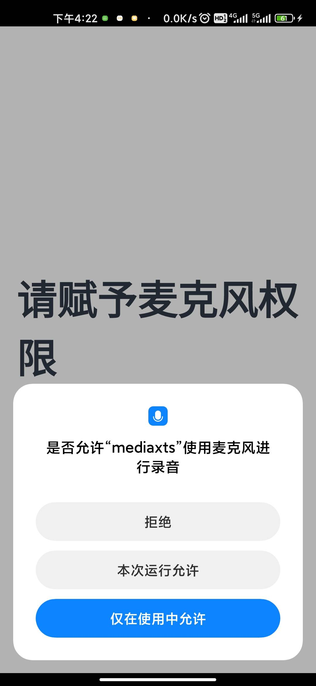
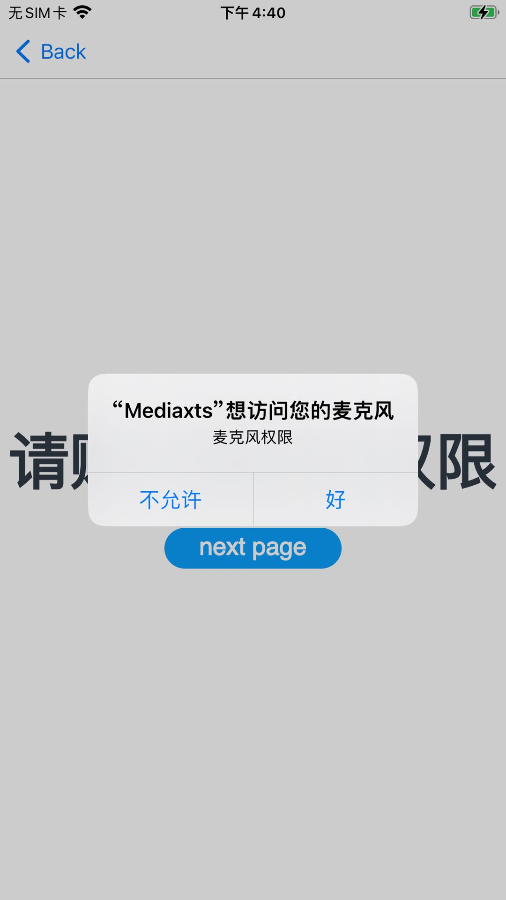

# media应用执行xts示例
## 使用说明

   1.执行xts测试命令，应用启动后首页会弹出系统弹窗。Android手机型号不同，弹窗展示效果以实际显示为准，需要手动点击“允许”等字样，否则没有录制音频    权限，xts会执行失败   

​   2.测试Android平台，需要先连接无线网络，在执行测试xts用例

* Android平台展示效果如下图：

   

   

-    iOS平台展示效果如下图：
                                                         
   

​                                           

